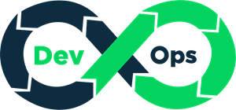

<!-- PROJECT TITLE -->
  <h1 align="center">Road to DevOps</h1>
<h2 align="center">
 About
</h2>

 This repository contains projects/exercises built while upskilling in DevOps skills

  
  &nbsp;
 &nbsp;
 &nbsp;
  &nbsp;
    &nbsp;
  &nbsp;
   &nbsp;
   &nbsp;
  &nbsp;
   &nbsp;
  &nbsp;

