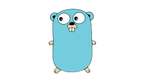

<!-- PROJECT TITLE -->
  <h1 align="center">FullStack</h1>
<h1 align="center">
 About
</h1>

 This repository contains projects/exercises built to acquire practical DevOps skills

## JavaScript

 

 

## Python

 

 

## HTML/CSS

 

 

## TDD & OOP

 

 
