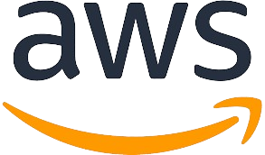
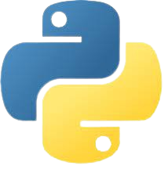

<!-- PROJECT TITLE -->
  <h1 align="center">FullStack Engineering</h1>
<h3 align="center">
 About
</h3>

 This repository contains projects/exercises built while acquiring full stack ev skills through the [App Academy Open]([https://wagtail.org](https://appacademy.io/course/app-academy-ope)n) curriculum

## JavaScript

 

 

## Python

 

 

## HTML/CSS

 

 

## TDD & OOP

 

 
